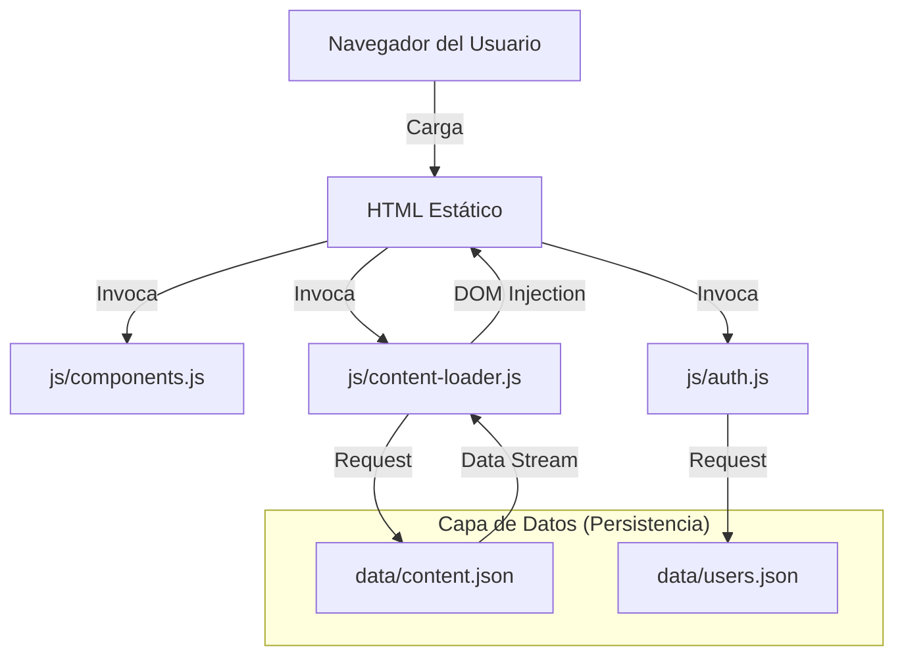
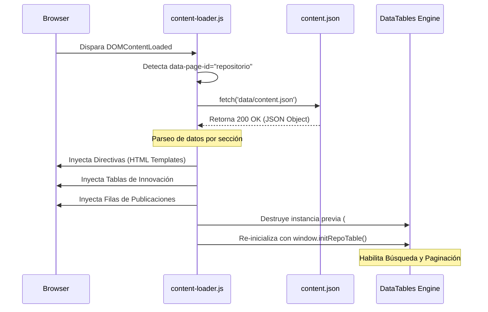
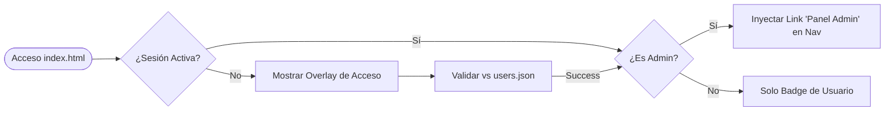
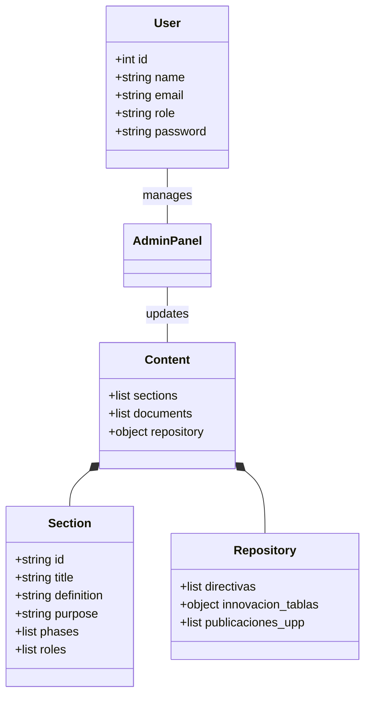

# Arquitectura Técnica y Flujos de Información - Portal AGROIDEAS

Este documento detalla la ingeniería detrás del Portal de Modernización de AGROIDEAS, centrándose en la lógica de desacoplamiento de datos, el flujo de carga dinámica y la arquitectura de administración segura.

---

## 1. Visión General del Sistema (High-Level)

El sistema opera bajo un modelo de **Frontend Dinámico Basado en JSON**. A diferencia de una SPA (Single Page Application) tradicional, este portal combina la SEO-compatibilidad de archivos HTML estáticos con la flexibilidad de un motor de inyección de datos asíncrono.

### Arquitectura de Interacción

---

## 2. Flujo de Información: Carga Dinámica

El proceso de visualización de datos desde el archivo físico hasta el renderizado final sigue una secuencia de eventos controlada por el estado del DOM.

### Secuencia de Carga de Repositorio

---

## 3. Arquitectura Administrativa y Seguridad

El Panel de Administración (`admin.html`) utiliza un puente de seguridad local gestionado por `auth.js`.

### Flujo de Acceso Administrador

### Gestión de Cambios y Persistencia (Admin Logic)
Cuando un administrador realiza cambios, el sistema no solo actualiza la vista, sino que prepara la persistencia mediante la simulación de un backend.

1.  **Captura**: El `admin-logic.js` recolecta los valores de los formularios.
2.  **Sincronización**: Actualiza el objeto `data` local en tiempo real.
3.  **Backup Automático**: Genera un archivo con timestamp (`content_backup_...json`).
4.  **Persistencia**: En un entorno productivo, el sistema dispara el guardado del archivo físico mediante el comando `exportJSON`.

---

## 4. Estructura de Objetos de Datos (UML)

La relación entre los datos almacenados y su representación en el sistema se describe a continuación:

---

## 5. Notas para el Especialista Web

*   **Extensibilidad**: Para añadir una nueva sección de gestión, basta con añadir un objeto en el nodo `sections` del `content.json` y crear el HTML correspondiente con el `data-page-id` coincidente.
*   **Gestión de Memoria**: El `content-loader.js` almacena los datos en una variable `this.data` para evitar múltiples peticiones `fetch` durante la navegación de la misma sesión.
*   **Integración DataTables**: Es crítico llamar a `DataTable().destroy()` antes de re-inyectar filas HTML, de lo contrario, el motor de búsqueda del plugin mantendrá los datos antiguos en caché.
*   **Seguridad**: El archivo `auth.js` utiliza un `MutationObserver` para asegurar que el contenido privado no pueda ser inyectado mediante manipulación manual del DOM por el usuario sin credenciales válidas.
